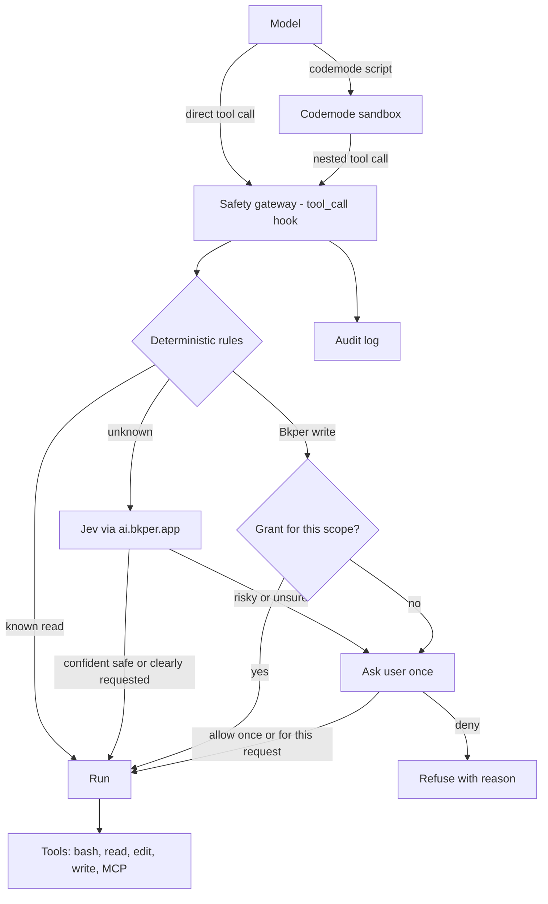

# Plan: Codemode, Safety Gateway (Jev), and MCP for `bkper agent`

Status: planned, not started. Written to be picked up by a separate implementation session.

Before starting, the implementing session must:

1. Read this document fully, then `AGENTS.md`.
2. Walk the **Open decisions** section with the user, one question at a time, and record the answers here.
3. Implement the phases in order. Each phase ships on its own and passes `bun run build` and `bun run test:unit`.

## 1. Goal

Give `bkper agent` three capabilities that pi 0.99 already implements, without reimplementing them:

- **Codemode**: the model writes one JavaScript script that calls tools (`bash`, `read`, MCP tools, ...) in parallel and returns only a summary. The result is fewer model turns, a smaller context, and computation that can be audited.
- **MCP**: connect Model Context Protocol servers from `mcp.json`.
- **Safety gateway**: one precise risk check on every tool call, both direct and nested inside codemode scripts. It uses deterministic rules first and Jev (a classifier model served by Bkper AI) only for ambiguous cases. It asks the user **rarely and meaningfully**. Asking too often trains users to accept blindly, which hurts security.

Non-goals:

- Reimplementing codemode, MCP, or tool search. We reuse pi's extensions.
- Hard-coded deny rules. The gateway either allows or asks. Only the user, or the lack of a user in non-interactive mode, can refuse.
- Sandboxing `bash` itself. The gateway judges intent and effect. It does not isolate processes.

## 2. Current state (facts, verified)

| Area | Fact | Where |
|---|---|---|
| pi version | `@earendil-works/pi-coding-agent` and `pi-tui` are pinned at `0.87.1`. Codemode, MCP, and tool search first shipped in `0.99.0`. | `package.json` |
| Session creation | The SDK path: `createAgentSessionServices` + `createAgentSessionFromServices`, with our own `extensionFactories`. SDK sessions do **not** load pi's built-in extensions. | `src/agent/interactive/run-agent-mode.ts` |
| Default tools | `read, bash, edit, write` (or `powershell` on Windows). | `resolveBkperAgentTools` in `src/agent/interactive/settings.ts` |
| System prompt | This is a full override. `getCodingToolDefinitions` only knows the 5 coding tools. The prompt tells the model to show and confirm every Bkper write in chat. | `src/agent/system-prompt.ts` |
| Extension relabeling | `normalizeBkperAgentExtension` relabels only paths matching `^<inline:\d+>$`. Named inline extensions become `<inline:name>` or `builtin:name` and are not touched. | `src/agent/extensions/builtins.ts` |
| Agent dir | Shared with pi: `~/.pi/agent` (holds `auth.json`, `sessions/`, `bkper-settings.json`, `bkper-input-history.jsonl`). pi's MCP extension would read `~/.pi/agent/mcp.json`. | pi `getAgentDir()` |
| Bkper AI provider | Legacy `ProviderConfig` with `api: 'openai-responses'`, `apiKey: '!bkper auth token'`, and `refreshModels` from `GET {baseUrl}/models`. It keeps only models with image input, so text-only models are dropped. | `src/agent/extensions/bkper-ai-provider.ts` |
| Jev in our layer | `ai.bkper.app` already serves `POST /v1/evaluations` backed by TypeSafe Jev (`jev`, aliases `jev-latest`, `typesafe-ai/jev`, ...). Question types are `noul` (bool), `choice`, and `score`. The response is `{model, answers, usage:{input_tokens, output_tokens}}`. `maxStateQuestionTokens` is 32,768. | `bkper-clients/packages/ai/server/src/evaluations/` |

pi APIs used (all in `@earendil-works/pi-coding-agent` 0.99):

- `createCodemodeExtension()`, `createToolSearchExtension()`, `createMcpExtension()`.
- Named inline extensions `{ name, factory, builtin: true, replaceable: true }`. These behave like pi's CLI built-ins: they load by default and can be disabled with `-builtin:<name>` in the `extensions` setting.
- `pi.on("tool_call", ...)`. It fires for direct calls **and** for calls nested inside codemode, which carry `parentToolCallId`. Returning `{ block: true, reason }` refuses the call. A nested refusal rejects inside the script with that reason.
- `ctx.modelRegistry.classify(model, { state, questions }, { signal })`.
- `ctx.ui.select(...)`, `ctx.hasUI`, and the `agent_start` / `agent_end` events.
- `ToolInfo.annotations` (`readOnlyHint`, `destructiveHint`, ...), filled from MCP tool annotations.
- Classifier providers: `registerProvider` accepts models with `type: "classifier"` plus a `classifiers: { [api]: { classify } }` map. See pi `docs/custom-provider.md`.

## 3. Architecture



## 4. Phases

### Phase 0: Upgrade pi to 0.99.x

- Bump `@earendil-works/pi-coding-agent` and `@earendil-works/pi-tui` to the same exact version (currently `0.99.1`).
- Read pi's `packages/coding-agent/CHANGELOG.md` entries for 0.99.0 and 0.99.1, especially the **Changed** section. For example, `--no-extensions` now also disables built-ins, and `bash` structured results changed. Fix compile errors and behavior changes.
- Tests: the existing suite passes. `builtins.test.ts` still relabels only numeric inline paths.

### Phase 1: Safety gateway, deterministic tier

This phase ships **before** codemode is enabled by default, because codemode can fire many writes at once.

New module: `src/agent/extensions/safety-gateway/`. Register it in `registerBkperAgentBuiltins`.

**1a. Bkper command effect registry (the source of truth).**

- Give every leaf `bkper` command an effect class: `read`, `write`, `structural`, `credential`, `local`.
- Keep the table next to command registration (for example `src/commands/command-effects.ts`) so it can't drift.
- A unit test builds the real commander tree (every `register*Commands`), walks all leaf commands, and **fails if any leaf has no effect entry**. A new command therefore can't silently go unclassified.

Proposed classes. The implementing session verifies each one against the actual command.

| Class | Commands | Gateway behavior |
|---|---|---|
| `read` | `book list/get`, `account list/get`, `group list/get`, `transaction list/get`, `balance list`, `collection list/get`, `file list/get`, `event list`, `app list/get/logs/status`, `auth status`, `--help`, `--version` | allow silently |
| `write` | `transaction create/update/post/check/uncheck/trash/untrash/merge` + batch variants, `account create/update` + batch, `group create/update`, `file upload`, `collection create/update/add-book/remove-book`, `event replay` | allow if a matching **grant** exists, else ask once and offer a grant |
| `structural` | `account delete`, `group delete`, `collection delete`, `file delete`, `book create/update/copy`, `app deploy/undeploy/install/uninstall/sync/secrets put/delete` | ask per call, no grant |
| `credential` | `auth token`, `auth login/logout` | ask per call. The token would enter the model context. |
| `local` | `app init/build/dev`, `agent`, `upgrade` | allow (local, reversible). `upgrade` asks. |

**1b. Bash/PowerShell command analysis.** This part is conservative.

- Split the command into segments on `;`, `&&`, `||`, `|`, and newlines. Detect `$(...)`, backticks, `eval`, `sh -c`/`bash -c`, `xargs`, and output redirects (`>`, `>>`, `tee`).
- A command is **known read** only if every segment is either a `read` bkper command or a small allowlist of read-only binaries (`ls`, `cat`, `head`, `tail`, `wc`, `rg`, `grep`, `find` without `-delete`/`-exec`, `jq`, `sort`, `uniq`, `git status/log/diff/show`, `pwd`, `echo`) **and** there is no redirect to a file.
- Any occurrence of `\bbkper\b` followed by a `write`/`structural`/`credential` command anywhere in the string (including inside `$(...)`, `sh -c`, `xargs`, `npx bkper`, and `bun x bkper`) classifies the whole call by the most severe match. Jev is not consulted for these, because they are exact.
- Anything else is **unknown** and goes to Jev (Phase 2). Until Phase 2 lands, unknown commands are allowed, which is today's behavior.

**1c. Other tools.**

- `read`, `grep`, `find`, `ls`: allow.
- `edit`/`write`: allow inside the working directory. Ask for sensitive paths: `~/.pi/agent/auth.json`, `~/.ssh/**`, `**/.env*`, anything outside the home directory.
- MCP tools (`mcp__<server>__<tool>`), using `pi.getAllTools()` annotations:
  - `readOnlyHint: true`: allow.
  - `destructiveHint: true`: grant per `(server, tool)` for the request.
  - No annotations: go to Jev.
- `codemode`: allow. The script itself is harmless; its nested calls are checked individually.

**1d. Grants: the anti-fatigue mechanism.**

- A grant key is `bkper:<resource>:<bookId|collectionId|*>` or `mcp:<server>:<tool>`.
- It lasts until the current agent run ends (`agent_end`), i.e. for the user's current request. Nothing persists across requests.
- Prompt (via `ctx.ui.select`) when no grant matches:
  - Title: `Create transactions in Book <id/name>?` Show the first command, and note that a codemode script may do more.
  - Options: `Allow once` · `Allow transaction writes in this book for this request` · `Deny`.
- Example: a codemode script that creates 40 transactions in one book asks **once**, not 40 times.
- Concurrency: codemode runs nested calls in parallel, so prompts go through one async mutex. After getting the lock, re-check the grant, so 40 parallel calls produce one prompt.
- Deny returns `{ block: true, reason: "User denied <summary>. Ask the user how to proceed." }`.

**1e. Non-interactive mode** (`!ctx.hasUI`: print/RPC/handoff runs): see decision D2.

**1f. Audit log.**

- Append JSONL to `~/.pi/agent/bkper-safety.jsonl`, one line per gated decision: time, session id, `toolCallId`, `parentToolCallId`, tool, input summary (truncated, with token-like strings redacted), tier (`deterministic`/`jev`), class, Jev probabilities, decision, grant key, user answer.
- Silent `read` allows are counted in the log but not written per line, to keep it small.
- This is also the data source for the ask-rate metric (section 6).

**1g. System prompt.** Update the write-confirmation principle in `src/agent/system-prompt.ts`. See decision D1.

### Phase 2: Jev tier via Bkper AI

**2a. Classifier model in the Bkper AI provider** (`bkper-ai-provider.ts`):

- Stop dropping evaluation models. Map `/models` entries with `type: 'evaluation'` to `{ type: 'classifier', api: 'bkper-evaluations', id: 'jev', ... }`. First check whether `/v1/models` lists evaluation models. If it doesn't, either add them server-side in `bkper-clients/packages/ai` or register `jev` statically.
- Add `classifiers: { 'bkper-evaluations': { classify } }`. `classify` does the following:
  - POSTs `{ model, state, questions }` to `{baseUrl}/evaluations` with the same auth and headers as chat (`bkper auth token`, `bkper-ai-source`).
  - Maps pi `bool` questions to wire `noul` and back. pi's `packages/ai/src/api/system-one-shared.ts` is the reference.
  - Maps `usage.input_tokens/output_tokens` to pi `Usage`.
- Unit test with a mocked `fetch`: request shape, bool↔noul mapping, usage mapping, error handling.

**2b. Gateway Jev call.** Only for **unknown** calls from Phase 1.

- `state` (trusted inputs only; **never tool outputs**, which could contain prompt injection):
  - `tool`, `input` (command or args, truncated)
  - `cwd`, `nested` (inside codemode)
  - `user_request`: the latest user message, truncated to about 2k chars
  - `parsed`: segments, binaries, redirects
- `questions`:
  - `effect`, a `choice`:
    - `read_only`: only reads or lists data.
    - `local_change`: creates or modifies files inside the working directory; reversible with git.
    - `local_destructive`: deletes or overwrites data outside version control or outside the working directory.
    - `remote_change`: changes state on a remote system (git push, deploy, publish, HTTP POST/PUT/DELETE, bkper-js scripts).
    - `secret_exposure`: reads, prints, or transmits credentials, tokens, or keys.
  - `requested`, a `bool`: the user's request explicitly asks for this action.
- Decision. The initial thresholds are tuned in Phase 5.
  - Allow if P(`read_only`) + P(`local_change`) ≥ 0.95.
  - Otherwise, allow and log if the top class is `local_destructive` or `remote_change` **and** P(`requested`) ≥ 0.9. This is the case of intent matching the user's words.
  - Otherwise, ask. `secret_exposure` always asks.
- Jev can only move an **unknown** call to allow or ask. It never overrides the deterministic Bkper write/structural/credential classes.
- Fail-safe: a Jev timeout (3 s) or error means **ask**. This affects only unknown calls, so a Jev outage adds prompts only to rare cases.
- Cache results per session keyed by `(tool, normalized input, hash(user_request))`.
- Cost: Jev costs about 42 nano-USD per input token plus markup, so one check of about 1k tokens is well under $0.001. Latency is added only to unknown calls.

### Phase 3: Codemode

- In `run-agent-mode.ts`, add to `extensionFactories`:
  ```ts
  {name: 'codemode', factory: createCodemodeExtension(), builtin: true, replaceable: true},
  {name: 'tool-search', factory: createToolSearchExtension(), builtin: true, replaceable: true},
  ```
- Add `codemode` to the default tool lists in `resolveBkperAgentTools`, gated by decision D4. Note that pi 0.99's `getDefaultTools()` already resolves `+name` / `-name` entries.
- System prompt: `getCodingToolDefinitions` doesn't know `codemode`. Add a snippet and guideline when it is selected. pi does not export its codemode prompt text, so write our own, Bkper-specific:
  - Use codemode for read-heavy, multi-command work: many books or accounts, filtering large `--format json` output, and computing totals with auditable code. Return summaries.
  - Bkper writes inside scripts are confirmed by the safety gateway. Keep writes grouped per book so one approval covers them.
- `codemode.mode` stays `on` (the default: direct tools remain declared).
- Tests: the session has `codemode` registered and active; the system prompt contains the guideline only when `codemode` is selected; nested calls reach the gateway (a test with a stub tool_call handler and `parentToolCallId`).

### Phase 4: MCP

- Add `{name: 'mcp', factory: createMcpExtension(), builtin: true, replaceable: true}`.
- With no `mcp.json` it does nothing. When a server connects with the default `codemode` exposure, it activates codemode automatically.
- Config location: decision D3.
- MCP tool calls already pass through the gateway (Phase 1c annotations, Phase 2 Jev).
- Check that `/mcp` and `pi mcp ...` equivalents behave inside `bkper agent`. Shell-level `pi mcp` subcommands are part of pi's CLI, not ours, so decide whether `bkper agent mcp ...` is needed or whether `/mcp` in-session is enough. Recommendation: `/mcp` only.
- Tests: the extension loads, and it's inert without config.

### Phase 5: Evaluation, tuning, rollout

- Fixture `test/fixtures/safety/commands.jsonl`: labeled cases `{tool, input, user_request, expected: allow|ask}`.
  - At least 150 cases: Bkper reads and writes, compound shell, `rm`, `git push`, `curl -X POST`, `bkper auth token | ...`, bkper-js scripts, MCP calls, and benign dev commands.
- A unit test runs the deterministic tier on all fixtures, with no network. Required: every labeled Bkper write/structural/credential case gets `ask` or a grant path (0 false negatives).
- Script `scripts/eval-safety.ts`, run manually, not in CI: runs the full pipeline with live Jev and reports:
  - false negatives (dangerous → allow), target 0
  - ask rate on benign cases, target ≤ 5%
  - per-threshold curves, used to pick final thresholds
- Rollout order:
  1. Phase 0
  2. Phase 1 and Phase 2 (gateway on)
  3. Phase 3 (codemode opt-in via `"defaultTools": ["+codemode"]`)
  4. Measure the ask rate from `bkper-safety.jsonl` on internal use
  5. Make codemode default (D4)
  6. Phase 4

## 5. Decisions

Resolved in the planning conversation:

- Reuse pi's extensions through their factories. Do not fork or reimplement them.
- No hard-coded deny rules. The gateway allows or asks. Refusals come only from the user (or D2).
- Jev runs through our own layer (`ai.bkper.app /v1/evaluations`), not a third-party key.
- Precision over coverage. Deterministic rules first, Jev only for ambiguous calls, and grants so a batch asks once.

Open. Ask the user one at a time; each has a recommendation:

- **D1. Chat confirmation rule.** Today the system prompt makes the model show every Bkper write and wait for chat confirmation. With the gateway, that would double-prompt.
  *Recommendation:* replace it with "Bkper writes are confirmed by the safety gateway; before writing, state what you will write and to which book". The rule to never let raw LLM output be the final accounting number stays unchanged.
- **D2. Non-interactive runs** (no UI).
  *Recommendation:* refuse `write`/`structural`/`credential` and Jev-`ask` calls with a clear reason, unless `bkper-settings.json` sets `safety.nonInteractive: "allow"`. There is nobody to ask, and silent irreversible writes are worse than a refused call.
- **D3. MCP config location.** Shared `~/.pi/agent/mcp.json` (same as `auth.json` and sessions today; a user's pi MCP servers also appear in `bkper agent`) versus a Bkper-only file.
  *Recommendation:* share it, consistent with the existing shared agent dir. Revisit if users complain.
- **D4. Codemode default.** Opt-in first, or default-on right after the gateway lands.
  *Recommendation:* opt-in until Phase 5 shows an ask rate ≤ 5% and 0 false negatives, then default-on.
- **D5. Grant scope.** Per request + resource + book (proposed), versus per session.
  *Recommendation:* per request. Session-wide grants recreate blind trust.
- **D6. Initial Jev thresholds.** 0.95 safe, 0.9 requested, 3 s timeout.
  *Recommendation:* start there and tune with `eval-safety.ts`.
- **D7. Evaluation models in `/v1/models`.** If they are missing, add them server-side (`bkper-clients/packages/ai`) or register `jev` statically in the CLI.
  *Recommendation:* server-side, so model IDs, pricing, and availability stay managed in one place.

## 6. Acceptance criteria

- `bun run build` and `bun run test:unit` pass after each phase.
- Every leaf `bkper` command has an effect class. The test fails otherwise.
- Deterministic fixtures: 0 Bkper write/structural/credential calls reach `allow` without a grant.
- A codemode script creating N transactions in one book produces exactly **one** prompt (test with parallel nested calls).
- A read-only session (lists, balances, JSON filtering in codemode) produces **zero** prompts.
- Jev outage: unknown calls ask; deterministic decisions are unaffected.
- The audit log records every non-silent decision with enough data to reproduce it.
- Live eval: 0 false negatives on dangerous fixtures, ≤ 5% ask rate on benign fixtures.

## 7. Risks and known gaps

- **Opaque local scripts.** `bun run script.ts` that writes to Bkper through bkper-js can't be seen deterministically. Jev sees only the command line and the user request.
  Mitigation: scripts that the agent itself wrote in this session could be scanned for `bkper-js` write calls later. That's out of scope for v1.
- **Prompt injection against Jev.** A command string crafted to look harmless could fool the classifier.
  Mitigation: Jev never overrides deterministic Bkper classes, and its state excludes tool outputs.
- **MCP annotations are declared by the server,** so a malicious server could mark a destructive tool `readOnlyHint`.
  Mitigation: only configure trusted servers. Optionally, D3 could later add per-server trust.
- **Shell parsing is heuristic.** Anything the parser doesn't fully understand falls to Jev, never to silent allow on the deterministic path.

## 8. File map (expected)

| File | Change |
|---|---|
| `package.json` | pi packages → 0.99.x |
| `src/agent/interactive/run-agent-mode.ts` | add codemode, tool-search, and MCP inline built-ins |
| `src/agent/interactive/settings.ts` | default tools (D4) |
| `src/agent/system-prompt.ts` | codemode guideline, D1 rule |
| `src/agent/extensions/builtins.ts` | register the safety gateway |
| `src/agent/extensions/safety-gateway/*.ts` | hook, shell analysis, policy, grants, Jev client call, audit log |
| `src/commands/command-effects.ts` | effect registry |
| `src/agent/extensions/bkper-ai-provider.ts` | classifier model + `bkper-evaluations` API |
| `test/unit/agent/extensions/safety-gateway/*.test.ts` | policy, grants, concurrency, fixtures |
| `test/unit/commands/command-effects.test.ts` | every leaf command classified |
| `test/fixtures/safety/commands.jsonl` | labeled cases |
| `scripts/eval-safety.ts` | live Jev evaluation |
| `bkper-clients/packages/ai` (other repo) | only if D7 requires listing evaluation models |
